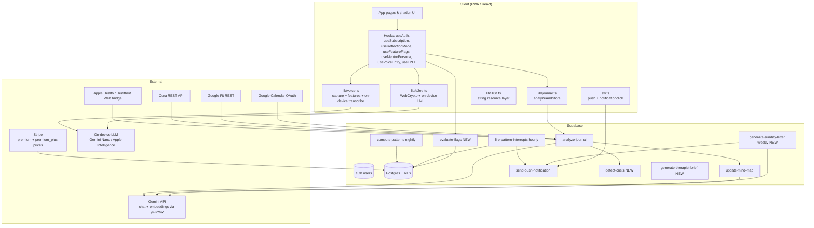
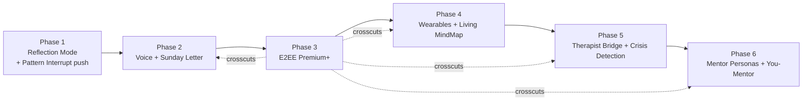

# Design Document

## Overview

This design realizes the ten-feature roadmap from `requirements.md` across six independently shippable phases. The design is deliberately incremental: it extends existing tables, edge functions, and UI surfaces rather than introducing parallel systems. Wherever the project already has working infrastructure (Pattern Interrupts via `user_patterns` + `compute-patterns` + `fire-pattern-interrupts`, MindMap via `mind_nodes` / `mind_edges` / `mind_node_entries`, Push via `push_subscriptions` + `send-push-notification`, Subscriptions via `subscriptions` keyed by Stripe `price_id` + `environment`), this design wires new behavior into those primitives.

The two largest architectural shifts are:

1. **Premium+ tier introduced in Phase 3.** Today `useSubscription` returns a boolean `isPremium`. The design replaces that with a `tier: "free" | "premium" | "premium_plus"` derived from `price_id` while keeping `isPremium` as a backwards-compatible alias. Stripe gets a new `price_id` mapped to `premium_plus`.

2. **Reflection_Mode + Mentor_Persona become the prompt composition layer.** `analyze-journal` today builds `SYSTEM_PROMPT` as a string constant. The design refactors prompt assembly into a small composable pipeline (`composePrompt({ mode, persona, voiceFeatures, contextSignals })`) so Phase 1, Phase 2, Phase 4, and Phase 6 features can layer on without each rewriting the function.

A central design principle: **E2EE_Mode (Phase 3) is a constraint, not a feature toggle scattered across the codebase.** Every feature that touches Journal_Entry plaintext is designed with two execution paths from the start — server-side (default) and client-side-only (E2EE). The phase-by-phase design calls out the client-side branch explicitly for each affected feature.

## Steering & Standards Compliance

No project steering files are present (`.kiro/steering/` is not configured). The project's existing conventions inferred from the codebase:

- **TypeScript strict mode**, React 18 with React Router v6 (`BrowserRouter`, `RequireAuth` guard)
- **shadcn/ui + Tailwind** for all UI; `framer-motion` for transitions; `lucide-react` for icons
- **Supabase RLS** on every user-scoped table; service role key used only inside edge functions
- **Edge functions** authenticate via Bearer token, instantiate two clients (auth-scoped and admin) when admin escalation is needed (see `analyze-journal`)
- **AI gateway**: `https://ai.gateway.lovable.dev/v1` via `LOVABLE_API_KEY` for embeddings/extraction, direct Google Generative Language API for chat with tool calls (`gemini-2.5-flash`, `gemini-2.5-flash-lite`)
- **Stripe** is environment-aware (`environment: "sandbox" | "live"` column on `subscriptions`, mirrored from `VITE_PAYMENTS_CLIENT_TOKEN` prefix)
- **PWA** with custom service worker (`src/sw.ts`) handling push and notificationclick

The design adheres to all six cross-cutting requirements (A–F) in the requirements doc. Specifically, every new feature is gated behind a feature flag (Cross-Cutting B), every schema change is additive with nullable columns or defaults (Cross-Cutting C), every UI surface follows shadcn accessibility patterns (Cross-Cutting D), every Phase 5 surface includes the disclaimer flow (Cross-Cutting E), and all new strings are routed through a translation layer introduced in Phase 1 (Cross-Cutting F).

## Architecture

### High-level component map



Existing components (already in the repo) are kept intact. Net-new components are labelled `NEW`.

### Phase-level deployment model

Each phase ships as a single migration bundle plus a single client release. Phases are gated end-to-end behind feature flags (Cross-Cutting B), so a phase's database migration can land on `main` ahead of its UI being made visible. This separation lets us bake migrations in production for days before exposing the feature, and it lets us kill a feature instantly without redeploying.



### Cross-cutting infrastructure (built once in Phase 1, reused after)

#### Tier resolution (`lib/tier.ts`, refactor of `useSubscription`)

```ts
type Tier = "free" | "premium" | "premium_plus";

const PREMIUM_PRICE_IDS = new Set([STRIPE_MONTHLY_PRICE, STRIPE_YEARLY_PRICE]);
const PREMIUM_PLUS_PRICE_IDS = new Set([STRIPE_PREMIUM_PLUS_MONTHLY, STRIPE_PREMIUM_PLUS_YEARLY]);

function resolveTier(sub: SubRow | null): Tier {
  if (!sub || !subIsActive(sub)) return "free";
  if (PREMIUM_PLUS_PRICE_IDS.has(sub.price_id ?? "")) return "premium_plus";
  if (PREMIUM_PRICE_IDS.has(sub.price_id ?? "")) return "premium";
  return "free";
}
```

`useSubscription` returns `{ tier, isPremium, isPremiumPlus, ... }`. `isPremium` is `tier !== "free"` (covers both Premium and Premium+) so existing callers (`Dashboard.tsx`, `Settings.tsx`, `Pricing.tsx`, `PremiumGate.tsx`) keep working unchanged. New gates use `isPremiumPlus` or the explicit `tier`.

#### Feature flags (`lib/feature-flags.ts` + `evaluate-flags` edge function)

A single Postgres table:

```sql
create table public.feature_flags (
  key text primary key,
  enabled boolean not null default false,
  rollout_percent int not null default 0 check (rollout_percent between 0 and 100),
  min_tier tier_enum not null default 'free',
  config jsonb not null default '{}'::jsonb,
  updated_at timestamptz not null default now()
);
```

Evaluation is deterministic: `hash(user_id || flag_key) % 100 < rollout_percent` AND `tier >= min_tier` AND `enabled`. The `evaluate-flags` edge function returns the `{ flag_key: boolean }` map for the authenticated user; the result is cached for 5 minutes in `react-query` and re-fetched on focus. A 250 ms timeout (per req B.4) collapses to "all disabled" on the client.

`useFeatureFlag("reflection_mode")` returns a boolean; `<FeatureGate flag="voice_entry">{children}</FeatureGate>` is the JSX wrapper. The flag map exposed to the client only contains keys the user is eligible for (req B.5).

#### i18n shim (`lib/i18n.ts`)

A thin wrapper around a flat JSON resource file, keyed by stable string IDs (e.g. `reflection_mode.toggle.label.companion`). Messages return the en-US value when no locale match exists; locale-aware date/duration formatters use `Intl.DateTimeFormat` and `Intl.NumberFormat`. No external i18n library introduced now to keep bundle size flat — switching to `react-intl` or `i18next` later is a one-file change.

---

## Components and Interfaces

### Phase 1 — Reflection_Mode + Pattern_Interrupt push

#### Reflection_Mode

**Schema additions** (additive, nullable):

```sql
-- profiles already exists; add reflection_mode
alter table public.profiles
  add column if not exists reflection_mode text
    not null default 'companion'
    check (reflection_mode in ('companion', 'challenger'));

-- annotate per-analysis which mode was active
alter table public.journal_analysis
  add column if not exists reflection_mode text
    check (reflection_mode in ('companion', 'challenger'));
```

**Edge function change** — `analyze-journal/index.ts` extracts prompt construction into a helper:

```ts
function composeSystemPrompt(opts: {
  mode: "companion" | "challenger";
  persona?: MentorPersonaDef;          // Phase 6
  voiceFeatures?: AcousticFeatures;    // Phase 2
  contextSignals?: ContextSignals;     // Phase 4
}): string {
  const base = BASE_PROMPT;
  const modeBlock = opts.mode === "challenger" ? CHALLENGER_BLOCK : COMPANION_BLOCK;
  // persona, voice, context blocks appended only if present
  return [base, modeBlock, /* later phases */].filter(Boolean).join("\n\n");
}
```

`CHALLENGER_BLOCK` adds the explicit instructions from req 1.5: name distortions from the existing taxonomy when supported by the entry, avoid validating language unsupported by the entry, include at least one concrete reframe. The function fetches `profiles.reflection_mode` (admin client read) inside `analyze-journal`, persists `reflection_mode` on the inserted `journal_analysis` row.

**Client surfaces:**

- `useReflectionMode()` — react-query hook reading/writing `profiles.reflection_mode` with optimistic update; mutation invalidates the profile query.
- `<ReflectionModeCard />` — new card in `pages/app/Settings.tsx` with a `<RadioGroup>` (shadcn), default `companion`. The 2-second propagation rule (req 1.3) is naturally satisfied by react-query's invalidate + the fact that the next `analyze-journal` call reads the freshly-persisted value server-side.
- One-line notice on entry result (req 1.8): a dismissible `<Alert>` mounted on the analysis result block in `pages/app/Dashboard.tsx` and `Journal.tsx`, scoped to that single result, gated by `analysis.reflection_mode === "challenger"`. Local state for dismissal via `sessionStorage` keyed by analysis ID.

**Failure paths** (req 1.4, 1.10):

- Persistence failure → optimistic update rolls back, toast surfaces error, prior value retained.
- Read of `reflection_mode` returns null/invalid → `composeSystemPrompt` defaults to `companion` and logs the fallback to `console.warn` so it surfaces in Supabase function logs.

#### Pattern_Interrupt push

The existing `compute-patterns` cron and `fire-pattern-interrupts` cron already implement the recurrence model — but they use **time-of-week** as the trigger, not **distortion recurrence** (req 2.1–2.2). The design extends rather than replaces:

**Schema additions:**

```sql
-- new pattern_type variant: distortion recurrence
alter table public.user_patterns
  add column if not exists distortion_label text,
  add column if not exists last_distortion_seen_at timestamptz;

-- broader notification preferences with channels
alter table public.notification_preferences
  add column if not exists pattern_interrupt_channel text
    not null default 'push' check (pattern_interrupt_channel in ('push', 'banner', 'off'));
```

**Edge function changes:**

- `compute-patterns` extends to compute `pattern_type = 'distortion_recurrence'`: scan each user's last 7 `journal_analysis` rows in the rolling 14-day window; for any distortion appearing in ≥ 3 rows, upsert a `user_patterns` row with `pattern_type = 'distortion_recurrence'`, `distortion_label`, `confidence = matches / 7`.
- `fire-pattern-interrupts` extends to handle `distortion_recurrence` pattern type: on hourly cron tick, for each matching pattern not fired in the rate-limit windows (1 per 24 h, 3 per 7 d per req 2.4), call `send-push-notification` with body of ≤ 180 chars referencing the distortion by name. Body builder strips any plaintext from analyses.
- Plaintext exclusion (req 2.3, 2.8): the body is composed solely from the `distortion_label` and a static template string per locale; entry text and email never enter the payload.

**Client surfaces:**

- `<PatternInterruptCard />` in Settings — toggle for `pattern_interrupt_channel` (push / banner only / off).
- In-app banner fallback (req 2.5): when push delivery fails or user is on Free tier (req 2.7), `fire-pattern-interrupts` writes a row to a new `pattern_interrupt_inbox` table; on next authenticated session, a top-of-app banner reads that inbox and displays for up to 7 days or until dismissed.

```sql
create table public.pattern_interrupt_inbox (
  id uuid primary key default gen_random_uuid(),
  user_id uuid not null references auth.users(id) on delete cascade,
  distortion_label text not null,
  body text not null,
  created_at timestamptz not null default now(),
  dismissed_at timestamptz,
  expires_at timestamptz not null default (now() + interval '7 days')
);
```

RLS: `user_id = auth.uid()` for select/update.

### Phase 2 — Voice-First + Sunday Letter

#### Voice-First Thought Dump

**Capture path** (`lib/voice.ts`):

```ts
async function startVoiceCapture(opts: { maxSeconds: 60; minSeconds: 3 }): Promise<VoiceClip> {
  const stream = await navigator.mediaDevices.getUserMedia({ audio: true });
  const recorder = new MediaRecorder(stream, { mimeType: "audio/webm;codecs=opus" });
  // accumulate, auto-stop at 60s, expose elapsed via a tick callback
}

type AcousticFeatures = {
  pace_wpm: number;          // transcript word count / duration in minutes
  hesitation_ratio: number;  // (silence + filler) / total
  tonal_variability_hz: number; // pitch SD via WebAudio AnalyserNode + autocorrelation
};

async function extractAcoustic(clip: VoiceClip, transcript: string): Promise<AcousticFeatures>;
```

Pace is computed from the transcript and clip duration. Hesitation ratio uses a simple energy-threshold silence detector plus a small filler-token regex applied to the transcript (`/\b(um+|uh+|like|you know|sort of)\b/gi`). Tonal variability uses `AudioContext.createAnalyser()` + a basic autocorrelation pitch estimator over 50 ms frames. All of this runs in-browser; no audio is uploaded for non-E2EE path either when on-device LLM is available, but for non-E2EE users we still upload audio for transcription.

**Two execution paths:**

- **Default (server-side):** browser uploads the webm clip to a signed URL, calls a new edge function `transcribe-voice-entry` which uses Gemini's audio input to produce transcript + diarization timestamps. Acoustic features computed client-side from the local clip after upload completes. Server deletes the audio object within 24 h via a scheduled function.
- **E2EE (Phase 3 dependency):** transcription runs entirely on-device via the browser's Speech Recognition API (`webkitSpeechRecognition` on Safari, `SpeechRecognition` on Chromium) when available; otherwise voice entry is hidden for E2EE users. Acoustic features extracted client-side. Transcript is encrypted client-side and stored as the Journal_Entry text per the existing E2EE branch.

**Schema additions:**

```sql
alter table public.journal_analysis
  add column if not exists voice_pace_wpm numeric,
  add column if not exists voice_hesitation_ratio numeric,
  add column if not exists voice_tonal_variability_hz numeric,
  add column if not exists is_voice_entry boolean not null default false;
```

`analyze-journal` accepts an optional `voice_features` payload. `composeSystemPrompt` appends a `VOICE_BLOCK` when present. Per req 3.9, the resulting `clarity_insight` references at least one of pace / hesitation / tonal variability — enforced by adding a tool-output check and a single retry pass with a stronger nudge if the first response omits all three.

**Client surface:**

- `<VoiceEntryButton />` mounted on `pages/app/Journal.tsx` and `Dashboard.tsx`. State machine: `idle → recording (with elapsed counter) → preview (Submit/Re-record/Discard) → submitting → done`. Stop control reachable by Enter/Space (req 3.13).
- Permission denied → non-blocking sonner toast; permission re-requested only on next explicit user click (req 3.3).
- Unsupported device → button hidden via capability check (`!('mediaDevices' in navigator)` or no `MediaRecorder.isTypeSupported('audio/webm')`); req 3.14.
- Free tier → 15-second demo with no persistence (req 3.12); enforced by client-side timer + by hiding the Submit button at all durations.

#### Sunday Letter from Yourself

**Schema additions:**

```sql
create table public.sunday_letters (
  id uuid primary key default gen_random_uuid(),
  user_id uuid not null references auth.users(id) on delete cascade,
  week_starts_on date not null, -- Monday of the covered week, in user's local TZ
  body text not null,
  generated_at timestamptz not null default now(),
  read_at timestamptz,
  unique (user_id, week_starts_on)
);

alter table public.profiles
  add column if not exists sunday_letter_enabled boolean not null default false,
  add column if not exists sunday_letter_time time not null default '09:00',
  add column if not exists sunday_letter_email_enabled boolean not null default false,
  add column if not exists sunday_letter_push_enabled boolean not null default false,
  add column if not exists timezone text not null default 'UTC';
```

**Cron + edge function:**

- New `generate-sunday-letter` edge function, scheduled hourly. On each tick: select profiles where `sunday_letter_enabled = true`, current local time matches `sunday_letter_time` (within the hour), today is Sunday in local TZ, and no `sunday_letters` row exists for the current `week_starts_on`. For each match, query the prior 7 days of analyses, compose a prompt that asks Gemini for: up to 5 themes, up to 3 distortions, up to 3 decisions, up to 3 prompts (200–800 words; req 4.3). Persist into `sunday_letters`. Then dispatch optional channels: `send-transactional-email` and/or `send-push-notification` per user prefs (req 4.2, 4.8 — only synthesized content, never plaintext entries).
- Fewer than 2 entries (req 4.4) → write a 1–2 sentence low-effort prompt instead of a full letter.
- E2EE_Mode (req 4.6) → skip server-side generation; client computes the letter on-device the next time the user opens the app on Sunday. Same `sunday_letters` row schema, but `body` is encrypted client-side before insert.

**Client surface:**

- `pages/app/Inbox.tsx` (new) — lists past Sunday letters with read state.
- `<SundayLetterCard />` in Settings — enable toggle, time picker (06:00–22:00 in 30 min increments per req 4.5), email + push channel checkboxes.
- Free tier (req 4.7) → monthly cadence; same edge function, runs on the 1st of each month covering the prior 30 days.

### Phase 3 — E2EE Private Mode + Premium+ tier

This is the deepest architectural change. Design intent: **the server stores ciphertext only; the on-device LLM produces the analysis; selective field opt-in determines which analysis fields sync (encrypted).**

#### Cryptography (`lib/e2ee.ts`)

- **Key derivation:** PBKDF2-HMAC-SHA-256, 600,000 iterations, 32-byte output, salt = first 16 bytes of `sha256(user_id)`. Source secret = user-supplied passphrase ≥ 12 chars (req 5.2). All via `window.crypto.subtle`.
- **Encryption:** AES-256-GCM. Per-record random 12-byte IV. Stored format: `base64url(iv || ciphertext || tag)`.
- **Key storage:** never persisted server-side. On the client: stored in IndexedDB (`crypto.subtle.exportKey("raw")` + AES-KW wrapped by a session-only key derived from a device biometric where available; falls back to "re-enter passphrase per session" when biometric unavailable).
- **Disclosure surface:** the in-app E2EE_Mode docs state KDF, cipher, iteration count, and irrecoverability explicitly.

#### Schema additions

```sql
create type tier_enum as enum ('free', 'premium', 'premium_plus');

alter table public.profiles
  add column if not exists e2ee_enabled boolean not null default false,
  add column if not exists e2ee_kdf_salt text,         -- public, used to derive key
  add column if not exists e2ee_passphrase_set_at timestamptz,
  add column if not exists e2ee_sync_fields jsonb not null default '[]'::jsonb;
  -- e2ee_sync_fields stores which analysis fields the user opts to sync
  -- (e.g. ["clarity_score", "intensity_score"] but never "summary" by default)

alter table public.journals
  add column if not exists is_encrypted boolean not null default false,
  add column if not exists ciphertext text;   -- replaces content for e2ee rows
  -- existing `content` column is left nullable; e2ee rows have content = NULL

alter table public.journal_analysis
  add column if not exists is_encrypted boolean not null default false;
  -- when true, all string fields stored in journal_analysis are themselves
  -- ciphertext; numeric fields (intensity_score, clarity_score) sync only
  -- if e2ee_sync_fields permits.
```

#### On-device LLM bridge

- **Detection:** `lib/on-device-llm.ts` exposes `getOnDeviceLLM(): Promise<OnDeviceLLM | null>`.
  - Chrome/Edge: probe `window.ai?.languageModel?.capabilities()` (Chrome Prompt API) for `available === "readily"`.
  - Safari/macOS: probe `window.AppleIntelligence?.available` (vendor-specific; replaced with the actual production API at the time of build).
- **Interface:** uniform `analyzeEntry(plaintext: string, opts: ComposeOpts): Promise<AnalysisFields>` — returns the same shape `analyze-journal` server path produces.
- **Unavailable** → E2EE_Mode activation blocked at toggle time (req 5.7). If it becomes unavailable mid-flight, analysis pauses and a toast notifies the user (req 5.13). No silent fallback to server-side ever (req 5.10).

#### Edge function gate

`analyze-journal` returns `403` with `{ code: "E2EE_REQUIRES_CLIENT" }` when the requesting user has `profiles.e2ee_enabled = true`, signalling the client to handle on-device. The same check is added to `update-mind-map` and the new `generate-sunday-letter` and `detect-crisis` so they never see E2EE plaintext.

#### Stripe + tier wiring

Add a new Stripe product "NexoMind Premium+" with two `price_id`s (monthly, yearly). Webhook handler `payments-webhook` already inserts `subscriptions` rows; no code change there since `price_id` is already persisted. `lib/tier.ts` resolves `premium_plus` from those new price IDs. `Pricing.tsx` gets a third tier card.

#### UI

- `pages/app/Settings.tsx` adds an `<E2EECard />` (gated by `tier === "premium_plus"`):
  - Disabled-state copy: "Premium+ required" with upgrade link.
  - Enabled-state copy: "Even we can't read your journal" plus the cryptographic disclosure (KDF, cipher, irrecoverability).
  - Activation flow: 3-step modal (passphrase → confirm passphrase → irrecoverability acknowledgement checkbox).
- `<E2EEStatusBadge />` shown in the Journal header when active.

### Phase 4 — Wearables + Living MindMap upgrade

#### Wearables + Calendar

**Schema additions:**

```sql
create table public.user_integrations (
  id uuid primary key default gen_random_uuid(),
  user_id uuid not null references auth.users(id) on delete cascade,
  provider text not null check (provider in ('apple_health','oura','google_fit','google_calendar','apple_calendar')),
  access_token_enc text,
  refresh_token_enc text,
  token_expires_at timestamptz,
  scopes jsonb not null default '[]'::jsonb,
  calendar_mask_titles boolean not null default true,
  connected_at timestamptz not null default now(),
  unique (user_id, provider)
);

alter table public.journal_analysis
  add column if not exists context_signals jsonb;
  -- shape: { sleep_minutes, hrv_avg, meeting_count_24h, meeting_minutes_24h, source_versions: {...} }
```

OAuth tokens are stored encrypted at rest via `pgsodium` (Supabase's transparent column encryption). For Apple Health, since there is no public web API, the design uses a thin native bridge in the PWA via the existing iOS PWA wrapper — for v1, ship `oura`, `google_fit`, `google_calendar` (web OAuth) and label Apple Health as "coming with iOS app" until the bridge ships.

**Edge function:** new `fetch-context-signals` invoked from `analyze-journal` (in-process, before AI call) with a hard 5-second total timeout (req 6.7). Each provider call uses 3-attempt exponential backoff capped at 30 s (req 6.6). Title masking enforced server-side (req 6.9): masked path only sends `{ count, total_minutes }`.

**Client surface:**

- `pages/app/Settings.tsx` adds `<IntegrationsCard />` listing each provider with Connect/Disconnect actions and the "Mask calendar titles" toggle.

#### Living MindMap upgrade

The repo already has `mind_nodes`, `mind_edges`, `mind_node_entries`, plus `update-mind-map`, `get-mind-map`, `mind-node-detail`. The upgrade adds the side-panel UX, semantic dedup quality bumps, and the 1k+ node performance path:

**Schema tweaks (additive):**

```sql
alter table public.mind_nodes
  add column if not exists embedding_3small vector(1536), -- if not present
  add column if not exists last_seen_at timestamptz default now();

create index if not exists idx_mind_nodes_user_lastseen
  on public.mind_nodes (user_id, last_seen_at desc);
```

**Algorithmic changes in `update-mind-map`:**

- Dedup threshold raised to cosine ≥ 0.85 (req 7.4); compute via `<#>` operator if `pgvector` is enabled, else compute in-memory with the existing top-200 candidate set.
- Per-analysis cap of 50 nodes, label length 1–80 chars (req 7.1) — already roughly the case (the function caps at 8 entities), tighten validation.
- Failure path (req 7.2): on extraction error, persist `journal_analysis` without nodes and log `mindmap_extraction_failed` with the analysis ID for operator review.

**UI changes in `pages/app/MindMap.tsx`:**

- Side panel via `<Sheet>` (shadcn) opens on node click; renders the prior 200-char excerpts with their analysis summaries, reverse chronological. Data fetched via existing `mind-node-detail` edge function.
- 1k+ node performance: when `nodes.length > 1000`, switch to clustered view via simple top-N-by-frequency filter in the initial render; full graph available behind "Show all" toggle. Maintains 30 fps target by capping rendered nodes to ~500 unless the user explicitly opts in.
- E2EE branch (req 7.10): when `profiles.e2ee_enabled = true`, MindMap nodes are extracted and stored client-side in IndexedDB, and node labels are stored server-side as ciphertext in `mind_nodes.label`. The MindMap page reads from the local store first, falling back to ciphertext + decrypt for cross-device sync.

### Phase 5 — Therapist Bridge + Crisis Detection

#### Phase-5 disclaimer infrastructure (Cross-Cutting E)

```sql
create table public.disclaimer_acceptances (
  id uuid primary key default gen_random_uuid(),
  user_id uuid not null references auth.users(id) on delete cascade,
  feature_key text not null,           -- 'therapist_bridge' | 'crisis_detection'
  disclaimer_version text not null,
  accepted_at timestamptz not null default now(),
  unique (user_id, feature_key, disclaimer_version)
);
```

Reused for both Phase 5 features. The disclaimer modal uses copy versioned with semver; bumping the version forces re-acknowledgement on next open.

#### Therapist Bridge

**No new tables** — purely a generation + export feature.

**New edge function** `generate-therapist-brief`:

- Input: `{ user_id, end_date }`. Pulls last 30 days of `journal_analysis` rows.
- Compose prompt that yields up to 5 themes, up to 3 distortions, mood arc data series, AI-selected 3–5 representative entries (selection criterion: highest absolute deviation from running averages of `intensity_score` and `clarity_score`), and a 500-word summary.
- 30-second timeout per req 8.1; on timeout returns 408 and the client surfaces a retry prompt.
- < 3 entries → 422 with `{ code: "INSUFFICIENT_DATA" }` (req 8.9).
- E2EE branch: function returns 403 with `{ code: "E2EE_REQUIRES_CLIENT" }`; the client builds the brief on-device using the same prompt template against the on-device LLM, plotting mood arc using locally-decrypted analysis fields.

**PDF generation:** client-side via `pdf-lib` (small, no native deps). The PDF template includes the Phase-5 disclaimer block (req 8.5) and a footer `Generated by NexoMind on YYYY-MM-DD`. Mood arc rendered as an SVG sparkline embedded in the PDF.

**UI:**

- `pages/app/TherapistBridge.tsx` — preview modal with per-entry redaction checkboxes (req 8.3), then Confirm → triggers PDF download or share-sheet.
- `<TherapistBridgeReminderCard />` in Settings — schedule reminder 1 hour to 7 days out via local notification + optional `.ics` calendar event.

#### Crisis Detection

**Schema additions:**

```sql
alter table public.profiles
  add column if not exists crisis_detection_enabled boolean not null default false,
  add column if not exists crisis_detection_locale_approved boolean not null default false,
  add column if not exists trusted_contact jsonb;
  -- shape: { name: string, channel: 'phone' | 'email', value: string, alert_text: string }

alter table public.journal_analysis
  add column if not exists crisis_signal numeric,
  add column if not exists crisis_signal_threshold_breached boolean default false;

create table public.crisis_events (
  id uuid primary key default gen_random_uuid(),
  user_id uuid not null references auth.users(id) on delete cascade,
  journal_id uuid references public.journals(id) on delete cascade,
  signal_score numeric not null,
  threshold numeric not null,
  surfaced_at timestamptz not null default now(),
  user_action text check (user_action in ('called_988','called_samaritans','contacted_trusted','dismissed','none')),
  user_action_at timestamptz,
  trusted_notified boolean not null default false
);
```

**New edge function** `detect-crisis`:

- Invoked from `analyze-journal` (after analysis insert) when `profiles.crisis_detection_enabled = true`.
- Computes `Crisis_Signal` as a weighted sum of: text-pattern score (regex + small classifier on `key_thoughts` and `summary`), and voice biomarker delta (when Voice_Entry; large negative deviation in `voice_pace_wpm` + high `voice_hesitation_ratio` → up-weights signal).
- Threshold value is loaded from a config row (`crisis_threshold` in `feature_flags.config`), set in the design phase and re-tunable post-launch (req 9.3, 9.8).
- Computation completes within 10 s of submission (req 9.2); function timeout enforced at 9 s with a 1 s buffer.
- On breach: insert `crisis_events` row, set `journal_analysis.crisis_signal_threshold_breached = true`. Client subscribes via realtime to surface the in-app card within 5 s (req 9.4).
- Auto-contact emergency services: explicitly forbidden (req 9.6). Trusted contact notification: only when user opts in **at the time of the event**, not at config time (req 9.5).

**UI:**

- `pages/app/Settings.tsx` adds `<CrisisDetectionCard />` with the 3-step consent flow (disclaimer → signals explanation → opt-in confirm; req 9.1).
- Trusted_Contact form below the toggle when enabled.
- `<CrisisCard />` overlay component listens via realtime subscription to `crisis_events` rows; renders 988 / Samaritans / locale-appropriate links + Trusted Contact action. Trusted contact alert ≤ 280 chars, no plaintext (req 9.5).
- Locale gate (req 9.9): toggle disabled with explanatory copy when `crisis_detection_locale_approved = false` for the user's locale; this flag is set per locale by the operator after compliance review.

### Phase 6 — Mentor Personas + You-Mentor

**Schema additions:**

```sql
create table public.mentor_personas (
  key text primary key,                                  -- e.g. 'stoic', 'cbt', 'no_bs', 'coach', 'future_self'
  name text not null,
  voice_block text not null,                             -- the prompt block describing voice/style
  compatible_modes text[] not null default '{companion,challenger}',
  is_curated boolean not null default true,
  display_order int not null default 0
);

alter table public.profiles
  add column if not exists active_mentor_persona text default null,
  add column if not exists default_mentor_persona text default null,
  add column if not exists you_mentor_profile jsonb;
  -- shape: { themes:[], vocab:[], reframe_style:string, refreshed_at:timestamptz, source_entry_count:int }

create table public.user_persona_switches (
  id uuid primary key default gen_random_uuid(),
  user_id uuid not null references auth.users(id) on delete cascade,
  persona_key text not null,
  switched_at timestamptz not null default now()
);
```

Curated personas are seeded via migration. Each `voice_block` is a paragraph-length string instructing tone, vocabulary, and idiom (no behavior — Reflection_Mode owns behavior).

**Edge function change:** `analyze-journal` reads the user's active persona, looks up `mentor_personas.voice_block`, passes it to `composeSystemPrompt` (PERSONA_BLOCK appended after MODE_BLOCK). Composition completes within 500 ms (req 10.3); the lookup is a single Postgres read against a small table (≤ 10 rows), so the budget is comfortable.

**You_Mentor profile derivation:**

- Eligibility: ≥ 30 entries with non-empty content (req 10.4). UI shows progress.
- Scheduled refresh: triggered every 10 new entries (req 10.5). New edge function `refresh-you-mentor`:
  - Pulls the user's last 30–200 analyses.
  - Calls Gemini with a tool that returns `{ themes:[], vocab:[], reframe_style }` (max 5/10/1).
  - Writes to `profiles.you_mentor_profile`.
- E2EE branch (req 10.7): runs on-device. Profile is stored locally in IndexedDB; only an encrypted blob may sync to `profiles.you_mentor_profile`.

**UI:**

- `<MentorPersonaPicker />` in `Journal.tsx` and `Settings.tsx` — lists curated personas + locked You_Mentor state when ineligible.
- `pages/app/MentorProfile.tsx` — view/edit `you_mentor_profile` fields; persistence happens before next prompt composition (req 10.6).
- Mode-conflict notice (req 10.8) when active persona's `compatible_modes` doesn't include the active Reflection_Mode — a one-line `<Alert>` in the entry result.
- Free tier (req 10.9): 1 switch per rolling 7-day window enforced via `user_persona_switches` count check on switch action; You_Mentor option blocked.

---

## Data Models

A consolidated view of every new or extended column. Existing columns omitted unless extended.

### Existing tables — extensions only

| Table | New columns | Phase |
|---|---|---|
| `profiles` | `reflection_mode text default 'companion' check ...` | 1 |
| `profiles` | `sunday_letter_enabled bool`, `sunday_letter_time time`, `sunday_letter_email_enabled bool`, `sunday_letter_push_enabled bool`, `timezone text` | 2 |
| `profiles` | `e2ee_enabled bool`, `e2ee_kdf_salt text`, `e2ee_passphrase_set_at timestamptz`, `e2ee_sync_fields jsonb` | 3 |
| `profiles` | `crisis_detection_enabled bool`, `crisis_detection_locale_approved bool`, `trusted_contact jsonb` | 5 |
| `profiles` | `active_mentor_persona text`, `default_mentor_persona text`, `you_mentor_profile jsonb` | 6 |
| `journals` | `is_encrypted bool default false`, `ciphertext text` (existing `content` becomes nullable when `is_encrypted = true`) | 3 |
| `journal_analysis` | `reflection_mode text check ...` | 1 |
| `journal_analysis` | `voice_pace_wpm numeric`, `voice_hesitation_ratio numeric`, `voice_tonal_variability_hz numeric`, `is_voice_entry bool` | 2 |
| `journal_analysis` | `is_encrypted bool` | 3 |
| `journal_analysis` | `context_signals jsonb` | 4 |
| `journal_analysis` | `crisis_signal numeric`, `crisis_signal_threshold_breached bool` | 5 |
| `mind_nodes` | `embedding_3small vector(1536)` (if not present), `last_seen_at timestamptz` | 4 |
| `notification_preferences` | `pattern_interrupt_channel text default 'push' check ...` | 1 |
| `user_patterns` | `distortion_label text`, `last_distortion_seen_at timestamptz` | 1 |

### New tables

| Table | Purpose | Phase |
|---|---|---|
| `feature_flags` | Server-evaluated flag store with rollout %, min_tier | 1 |
| `pattern_interrupt_inbox` | Banner fallback when push unavailable / Free tier | 1 |
| `sunday_letters` | Generated weekly letters | 2 |
| `user_integrations` | OAuth tokens for wearables and calendar | 4 |
| `disclaimer_acceptances` | Phase 5 disclaimer audit log | 5 |
| `crisis_events` | Crisis detection events + user actions | 5 |
| `mentor_personas` | Curated persona catalog | 6 |
| `user_persona_switches` | Switch log for Free-tier rate limiting | 6 |

All new tables have RLS:
- `select`, `update`, `delete`: `user_id = auth.uid()` for user-owned tables
- `insert`: `user_id = auth.uid()` (or service-role only for `crisis_events`, `pattern_interrupt_inbox`, `sunday_letters` since those are written by edge functions)
- `mentor_personas` and `feature_flags`: `select` open to authenticated users; `insert/update/delete` service-role only

---

## Error Handling

Universal patterns:

1. **Edge function errors** return JSON `{ error, code }` with appropriate HTTP status. Codes are stable strings the client matches against (e.g. `FREE_LIMIT_REACHED`, `E2EE_REQUIRES_CLIENT`, `INSUFFICIENT_DATA`).
2. **Client mutations** surface errors via `sonner` toasts with copy from the i18n layer; never expose raw error messages.
3. **Background failures** (cron functions, fire-and-forget invokes) log to `console.error` with a stable prefix and feature key; we keep an existing Supabase log query for ops review.
4. **E2EE branch failures** never silently fall back to server-side. The user is shown a clear "analysis paused" state until on-device LLM is available.

Per-feature failure paths are spelled out inline in Components and Interfaces above (Reflection_Mode persistence rollback, Voice_Entry transcription retry, Sunday_Letter retry-and-skip, MindMap extraction failure logging, Therapist_Brief 30s timeout, Crisis_Signal 9s timeout, persona load fallback to default).

---

## Testing Strategy

### Unit tests (`vitest`)

- `lib/tier.ts` — tier resolution from each `price_id` set, expired periods, canceled-but-still-in-period
- `lib/e2ee.ts` — round-trip encrypt/decrypt, KDF determinism, key wrap/unwrap, passphrase length validation
- `lib/voice.ts` — acoustic feature math against a small fixtures library (a few reference webm clips with known WPM)
- `lib/feature-flags.ts` — deterministic hashing, percentage rollout boundary cases, fail-closed on timeout

### Integration tests (Vitest + Supabase local)

- `analyze-journal` with `reflection_mode = 'companion'` vs `'challenger'` → assert prompt block presence, assert annotation persisted
- `analyze-journal` for E2EE user → assert 403 with `E2EE_REQUIRES_CLIENT`
- `compute-patterns` distortion_recurrence variant → seed 7 analyses with overlapping distortions, assert pattern row written
- `fire-pattern-interrupts` → assert rate-limit windows, assert no plaintext in push body
- `generate-sunday-letter` → assert weekly idempotency via `(user_id, week_starts_on)` unique key
- `detect-crisis` → assert threshold breach inserts `crisis_events`, assert no auto-emergency-contact path exists
- `update-mind-map` dedup → seed embeddings just under and just over 0.85 cosine, assert merge behavior

### End-to-end tests (Playwright, new — keep small)

- Onboarding through Settings → toggle Reflection_Mode → submit entry → assert challenger annotation appears in result
- Voice entry happy path (with mock `getUserMedia`) → assert transcript persists, acoustic fields populated
- E2EE activation flow → 3-step modal, irrecoverability ack, then writing an entry → assert no plaintext exits the network tab
- Therapist Bridge generation → preview redaction → PDF download → assert disclaimer footer in the rendered PDF text

### Manual QA checklists

- Accessibility (keyboard-only pass + axe automated scan) on every new surface (Cross-Cutting D)
- Push notification testing on iOS PWA (requires installed-to-home-screen + iOS 16.4+) and Android Chrome
- Wearable integration testing: connect each provider, disconnect, verify token purge within 24 h
- Crisis Detection clinical advisor sign-off recorded before GA (Cross-Cutting E)

### Performance budgets

- Living MindMap initial paint at 1k nodes: ≤ 100 ms first paint, sustain ≥ 30 fps during pan
- `composeSystemPrompt` server-side budget: ≤ 500 ms (req 10.3)
- `detect-crisis` budget: ≤ 9 s (req 9.2 with 1 s safety margin under the 10 s ceiling)
- `generate-therapist-brief` budget: ≤ 30 s (req 8.1)
- Feature flag eval budget: ≤ 250 ms (req B.4)

---

## Correctness Properties

System-wide invariants the design must preserve at every phase boundary. These are the things that, if violated, indicate a regression even if all unit tests pass.

### Property 1: Tier monotonicity

**Validates: Requirements 1.7, 2.7, 5.10, 7.9, 8.7, 9.10, 10.9**

A user upgrading from Free → Premium → Premium+ never loses access to a feature they had in the lower tier. Premium+ is a strict superset of Premium, which is a strict superset of Free. Verifiable by enumerating `featureAvailability(tier)` and asserting set inclusion.

### Property 2: E2EE plaintext containment

**Validates: Requirements 5.3, 5.4, 5.8, 3.11, 4.6, 7.10, 8.6, 10.7**

When `profiles.e2ee_enabled = true`, no Journal_Entry plaintext, Voice_Entry transcript, MindMap node label, Sunday_Letter body, Therapist_Brief content, or You_Mentor profile field ever appears in unencrypted form in any server-stored row, edge function log, network request body to the server, or third-party API call. Verifiable by network capture in the E2EE end-to-end test plus a server log scan for known plaintext markers.

### Property 3: Push payload minimality

**Validates: Requirements 2.3, 2.8, 4.8**

No push notification body delivered by `send-push-notification` ever contains Journal_Entry plaintext, the user's email address, or any user identifier beyond what is required to render the notification. Verifiable by inspecting every call site that builds a push body — Pattern_Interrupt, Sunday_Letter, future notifiers — against a single sanitizer applied at the edge.

### Property 4: Backwards compatibility on read

**Validates: Requirements 1.6, 3.8, 4.3, 7.3, 9.7, 10.5**

For every page (Journal, Insights, MindMap, Dashboard) and every column added by this roadmap, a row inserted before the column existed renders without throwing and without an error indicator. Verifiable by the prior-phase regression suite per Cross-Cutting A.5.

### Property 5: Feature-flag fail-closed

**Validates: Requirements 1.7, 2.6, 5.1, 9.10**

When the flag-evaluation edge function times out or errors, the client behaves as though every roadmap feature is disabled — no UI affordance, no API call, no error thrown to the user. Verifiable by chaos-testing the flag function with induced 500s and timeouts.

### Property 6: No silent degradation of E2EE analysis

**Validates: Requirements 5.10, 5.13**

When the on-device LLM becomes unavailable mid-flight for an E2EE user, analysis pauses and the user is notified. The system never falls back to a server-side model with plaintext. Verifiable by simulating on-device-LLM-unavailable in the E2EE test path.

### Property 7: Crisis Detection consent gate

**Validates: Requirements 9.1, 9.7, 9.9**

No Crisis_Signal is computed for any user whose `disclaimer_acceptances` row for `crisis_detection` does not exist or is older than the current disclaimer version. Verifiable by query and by integration test that flips a user from disabled to enabled and asserts no signal appears for entries written before the flip.

### Property 8: Reflection_Mode propagation latency

**Validates: Requirements 1.3, 1.4, 1.10**

A change to `profiles.reflection_mode` is visible to the next `analyze-journal` invocation that begins more than 2 seconds after persistence completes. Verifiable by an integration test that toggles the mode, waits 2 s, submits an entry, and asserts the resulting `journal_analysis.reflection_mode` matches.

### Property 9: Idempotent weekly delivery

**Validates: Requirements 4.1, 4.9, 4.10**

`sunday_letters` has a unique constraint on `(user_id, week_starts_on)`. The `generate-sunday-letter` edge function never produces a duplicate row for the same user-week even under retry. Verifiable by the unique constraint plus a retry stress test.

### Property 10: MindMap dedup convergence

**Validates: Requirements 7.4, 7.2**

For any two MindMap_Nodes with cosine similarity ≥ 0.85, the system collapses them to a single node. Re-running `update-mind-map` on the same analysis is idempotent. Verifiable by a unit test seeding embeddings on either side of the threshold and a property test that running the merge twice produces the same graph.

## Open Decisions

These items are intentionally left as design-phase decisions to be locked before tasks are written:

1. **On-device LLM API name** — Apple Intelligence's web-exposed surface is still vendor-specific. We design against an interface and pick the concrete API at Phase 3 implementation.
2. **Crisis_Signal threshold value** — must be set with the clinical advisor before GA (req 9.3). Held in `feature_flags.config` so it can be tuned post-launch without redeploy.
3. **Premium+ pricing** — Stripe price IDs need to be created. Assumption: $19.99/mo or $190/yr based on E2EE peer pricing; final number is a product decision.
4. **Apple Health bridge** — for Phase 4, do we ship without Apple Health (web-only providers) or block Phase 4 on the iOS native bridge? Recommendation: ship without, label as iOS-app-only.
5. **Locales for Crisis Detection at GA** — recommend en-US + en-GB only at first launch; add locales after each compliance review.
